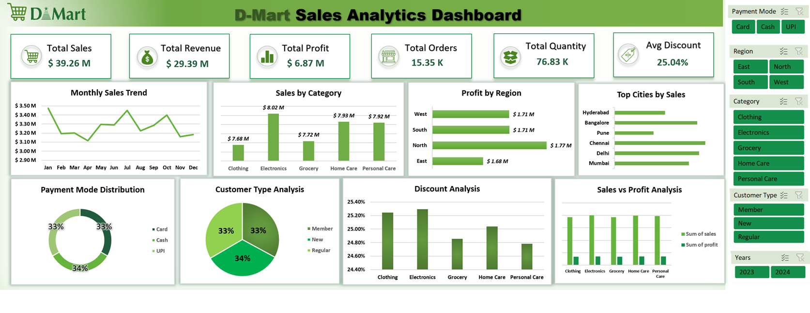
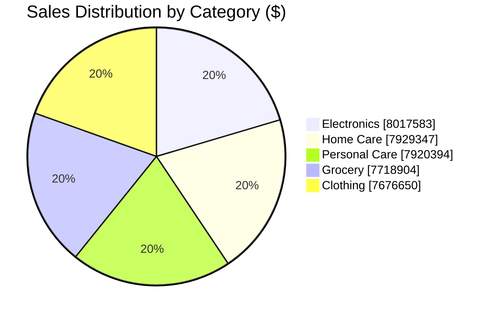
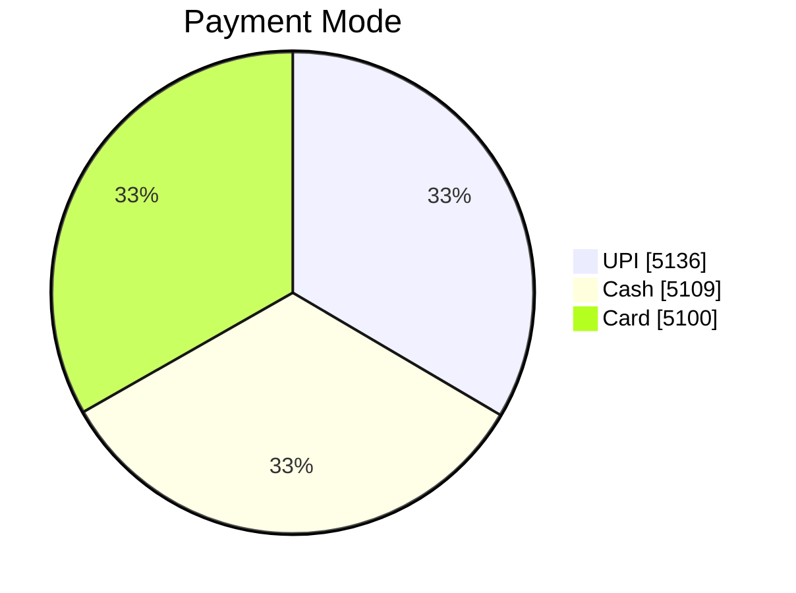
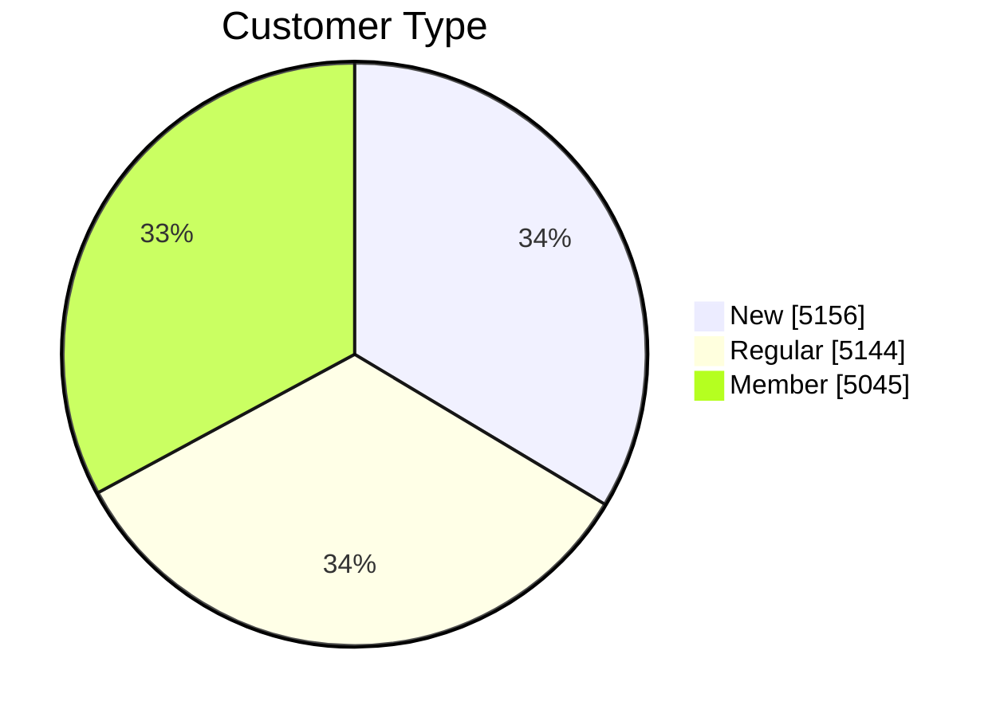
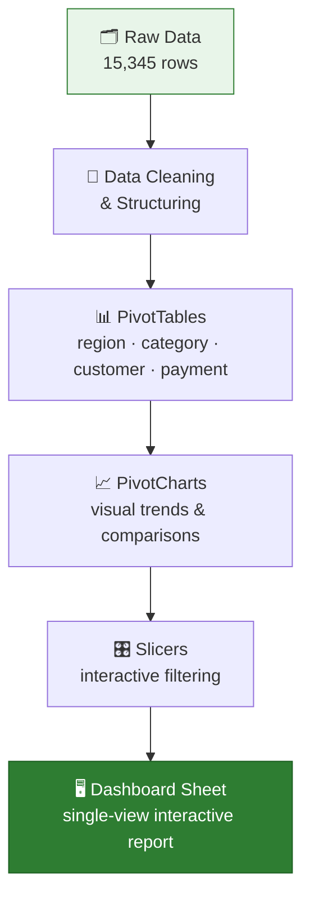

<div align="center">

# 🛒 D-Mart Sales Analysis

### An interactive Excel sales dashboard built with PivotTables, PivotCharts & Slicers


</div>

<br>

<div align="center">

## 🖼️ Dashboard Preview



</div>

<br>

## 📌 Overview

This project analyzes two years of **synthetic D-Mart retail sales data** (2023–2024) and turns it into a fully interactive, native-Excel dashboard — no Python, no Power BI, just PivotTables, PivotCharts, and slicers doing the heavy lifting.

The goal was simple: take a raw transactional dataset and build something a retail/business team could actually click through to answer questions like *"Which region is underperforming?"* or *"Are Members spending more than Regular customers?"*

<br>

## 📊 Key Metrics

<div align="center">

| 🧾 Orders | 💰 Sales | 📈 Profit | 📦 Units | 🎯 Avg Discount |
|:---:|:---:|:---:|:---:|:---:|
| **15,345** | **$39.26M** | **$6.87M** | **76,831** | **25.04%** |

</div>

<br>

## 🍩 Sales by Category



<details>
<summary>📶 View as bar chart</summary>

```
Electronics     ████████████████████████ $8.02M
Home Care       ████████████████████████ $7.93M
Personal Care   ████████████████████████ $7.92M
Grocery         ███████████████████████  $7.72M
Clothing        ███████████████████████  $7.68M
```

</details>

Categories are remarkably balanced — no single category dominates, with **Electronics** edging out as the top performer.

<br>

## 🌍 Profit by Region

```
North   ████████████████████████ $1.77M
South   ███████████████████████  $1.71M
West    ███████████████████████  $1.71M
East    ███████████████████████  $1.68M
```

**North** leads in profitability, while **East** trails slightly — a ~5% spread across all four regions.

<br>

## 💳 Payment Mode & 👥 Customer Mix

<table>
<tr>
<td width="50%">



</td>
<td width="50%">



</td>
</tr>
</table>

Both splits land almost perfectly evenly — roughly a **33/33/33** distribution across payment methods and customer segments.

<br>

## 🏙️ Top Cities by Sales

```
Chennai      ████████████████████████ $6.64M
Delhi        ████████████████████████ $6.61M
Bangalore    ████████████████████████ $6.60M
Mumbai       ████████████████████████ $6.56M
Hyderabad    ███████████████████████  $6.45M
Pune         ███████████████████████  $6.39M
```

<br>

## ⚙️ How It Was Built



Everything was built **natively in Excel** — a deliberate choice to demonstrate core spreadsheet/BI fundamentals (PivotTables, calculated fields, chart design, slicer-based interactivity) without relying on external tooling.

<br>

## 🧰 Tech Stack

<div align="center">


</div>

<br>

## 📁 Repository Structure

```
dmart-sales-analysis/
├── Dmart Sales Data.xlsx     # Full workbook — raw data, pivot table & dashboard
├── Dashboard.png             # Dashboard screenshot / preview
└── README.md                 # You are here
```

Inside the workbook:

| Sheet | Description |
|---|---|
| 🗂️ `Data` | 15,345 rows of raw transactional sales data |
| 📊 `Pivot Table` | Aggregated views (sales, profit, quantity) sliced by region, category, customer type, and payment mode |
| 🖥️ `Dashboard` | Interactive dashboard combining PivotCharts + Slicers into one view |

### Columns in the raw data

`order_id` · `region` · `category` · `sales` · `discount` · `net_sales` · `sales_volume` · `quantity` · `order_date` · `delivery_date` · `customer_type` · `payment_mode` · `profit` · `city`

<br>

## 🔍 What the Dashboard Lets You Explore

| | |
|---|---|
| 🌍 | **Regional performance** — compare sales & profit across North, South, East, and West |
| 🛍️ | **Category trends** — see which product categories drive the most revenue |
| 👥 | **Customer segments** — New vs Regular vs Member buying behavior |
| 💳 | **Payment preferences** — Cash vs Card vs UPI split |
| 🗓️ | **Time trends** — sales patterns across 2023–2024 |
| 🎛️ | **Live filtering** — slice everything instantly using the built-in slicers |

<br>

## 🚀 How to Use

1. 📥 Download `Dmart Sales Data.xlsx`
2. 📗 Open it in Microsoft Excel (2016 or later recommended for slicer support)
3. 🖥️ Head to the **Dashboard** sheet
4. 🎛️ Click any slicer button (region, category, customer type, etc.) to filter the entire dashboard live

<br>

## 🎯 Why This Project

This was built as part of a presentation on *"The Changing Role of a Data Analyst in the Age of GenAI"* — as a live, click-through demo showing that solid fundamentals (clean data + PivotTables + thoughtful dashboard design) are still at the core of good analysis, even as AI tools reshape the workflow around them.

> 📝 **Note:** The dataset is synthetic and was generated for practice/portfolio purposes — it does not represent real D-Mart sales figures.

---

<div align="center">

Built with 📊 in Excel · by **Arfan**

</div>
